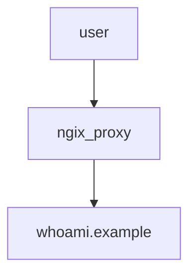

# auto-reverse-proxy



### proxy up
- https://docs.docker.com/compose/features-uses/
```bash
$ docker compose -f compose.yml up -d
[+] Running 2/2
 ✔ Container auto-reverse-proxy-nginx-proxy-1  Started        0.0s 
 ✔ Container auto-reverse-proxy-whoami-1       Started 

$ docker compose -f compose.yml ps
NAME                               IMAGE                    COMMAND                                       SERVICE       CREATED         STATUS              PORTS
auto-reverse-proxy-nginx-proxy-1   nginxproxy/nginx-proxy   "/app/docker-entrypoint.sh forego start -r"   nginx-proxy   8 minutes ago   Up About a minute   0.0.0.0:8949->80/tcp, :::8949->80/tcp
auto-reverse-proxy-whoami-1        jwilder/whoami           "/app/http"                                   whoami        9 minutes ago   Up About a minute   8000/tcp

$ docker compose -f compose.yml images
CONTAINER                          REPOSITORY               TAG                 IMAGE ID            SIZE
auto-reverse-proxy-nginx-proxy-1   nginxproxy/nginx-proxy   latest              f0ee028e9dcd        203MB
auto-reverse-proxy-whoami-1        jwilder/whoami           latest              89be8564e650        10.1MB
```

### proxy stop/start/down/images
```bash
$ docker compose -f compose.yml stop
[+] Stopping 2/2
 ✔ Container auto-reverse-proxy-whoami-1       Stopped  0.4s 
 ✔ Container auto-reverse-proxy-nginx-proxy-1  Stopped

$ docker compose -f compose.yml ps -a
NAME                               IMAGE                    COMMAND                                       SERVICE       CREATED          STATUS                      PORTS
auto-reverse-proxy-nginx-proxy-1   nginxproxy/nginx-proxy   "/app/docker-entrypoint.sh forego start -r"   nginx-proxy   14 minutes ago   Exited (2) 26 seconds ago
auto-reverse-proxy-whoami-1        jwilder/whoami           "/app/http"                                   whoami        15 minutes ago   Exited (2) 26 seconds ag

$ docker compose -f compose.yml start

# https://docs.docker.com/engine/reference/commandline/compose_down/
# Stop and remove containers, networks
$ docker compose -f compose.yml down
```

### Testing with command line
```bash
$ curl -H "Host: whoami.example" localhost
I'm 72a36bee5c59
```

### Testing with Chrome Browser in Windows
1. Modifying to hosts file(c:\Windows\System32\drivers\etc\hosts) administrator privileges
    ```bash
    # dj26
    127.0.0.1	whoami.example
    ```

2. Open whoami.example in your browser

    

### docker stats
- Display a live stream of container(s) resource usage statistics
- https://docs.docker.com/engine/reference/commandline/stats/
```bash
$ docker stats --no-stream
CONTAINER ID   NAME                               CPU %     MEM USAGE / LIMIT     MEM %     NET I/O           BLOCK I/O   PIDS
9151f59828d6   auto-reverse-proxy-nginx-proxy-1   0.26%     62.35MiB / 7.625GiB   0.80%     6.08kB / 5.59kB   0B / 0B     28
72a36bee5c59   auto-reverse-proxy-whoami-1        0.00%     2.66MiB / 7.625GiB    0.03%     4.76kB / 2.01kB   0B / 0B     5
```

### Scale out / in
```bash
$ docker compose up -d
[+] Running 3/3
 ✔ Network auto-reverse-proxy_default          Created        0.1s 
 ✔ Container auto-reverse-proxy-whoami-1       Started        0.0s 
 ✔ Container auto-reverse-proxy-nginx-proxy-1  Started        0.0s 
$ docker compose ps   
NAME                               IMAGE                    COMMAND                                       SERVICE       CREATED         STATUS         PORTS
auto-reverse-proxy-nginx-proxy-1   nginxproxy/nginx-proxy   "/app/docker-entrypoint.sh forego start -r"   nginx-proxy   8 minutes ago   Up 8 minutes   0.0.0.0:80->80/tcp, :::80->80/tcp
auto-reverse-proxy-whoami-1        jwilder/whoami           "/app/http"                                   whoami        8 minutes ago   Up 8 minutes   8000/tcp
$ docker compose up -d --scale whoami=3
[+] Running 4/4
 ✔ Container auto-reverse-proxy-nginx-proxy-1  Running        0.0s 
 ✔ Container auto-reverse-proxy-whoami-1       Running        0.0s 
 ✔ Container auto-reverse-proxy-whoami-3       Started        0.0s 
 ✔ Container auto-reverse-proxy-whoami-2       Started        0.0s 
$ docker compose ps   
NAME                               IMAGE                    COMMAND                                       SERVICE       CREATED         STATUS         PORTS
auto-reverse-proxy-nginx-proxy-1   nginxproxy/nginx-proxy   "/app/docker-entrypoint.sh forego start -r"   nginx-proxy   8 minutes ago   Up 8 minutes   0.0.0.0:80->80/tcp, :::80->80/tcp
auto-reverse-proxy-whoami-1        jwilder/whoami           "/app/http"                                   whoami        8 minutes ago   Up 8 minutes   8000/tcp
auto-reverse-proxy-whoami-2        jwilder/whoami           "/app/http"                                   whoami        6 seconds ago   Up 5 seconds   8000/tcp
auto-reverse-proxy-whoami-3        jwilder/whoami           "/app/http"                                   whoami        6 seconds ago   Up 5 seconds   8000/tcp
$ docker compose up -d --scale whoami=1
[+] Running 2/2
 ✔ Container auto-reverse-proxy-whoami-1       Running        0.0s 
 ✔ Container auto-reverse-proxy-nginx-proxy-1  Running        0.0s 
$ docker compose down                  
[+] Running 3/3
 ✔ Container auto-reverse-proxy-whoami-1       Removed        0.4s 
 ✔ Container auto-reverse-proxy-nginx-proxy-1  Removed        1.0s 
 ✔ Network auto-reverse-proxy_default          Removed
```

### compose command

#### up

- [ ] docker compose up --help
- [ ] https://docs.docker.com/engine/reference/commandline/compose_up/

```
-d: (docker run -d 옵션 처럼) 서비스 실행이 데몬으로 실행됨
--build: 서비스 (다시)시작 하고 이미지를 새로 만듬(Dockerfile 이 변경되는 경우 사용)
--force-recreate: 컨테이너를 지우고 새로 만듬
```

#### ps

- 현재 환경에서 실행 중인 각 서비스의 상태를 보여줍니다.

#### stop, start

- 서비스를 멈추거나, 멈춰 있는 서비스를 시작합니다.

#### down

- 서비스를 지웁니다. 컨테이너와 네트워크를 삭제하며, 옵션(--volume)에 따라 볼륨도 지웁니다.

#### logs

- 서비스의 로그를 확인할 수 있습니다. logs 뒤에 서비스 이름을 적지 않으면 도커 컴포즈가 관리하는 모든 서비스의 로그를 함께 보여줍니다.


### Scale Up / Down
```bash
$ docker compose up -d
[+] Running 4/4
 ✔ Network auto-reverse-proxy_default          Created        0.1s 
 ✔ Container auto-reverse-proxy-whoami-2       Started        0.0s 
 ✔ Container auto-reverse-proxy-nginx-proxy-1  Started        0.0s 
 ✔ Container auto-reverse-proxy-whoami-1       Started        0.0s 
$ docker compose ps
NAME                               IMAGE                    COMMAND                                       SERVICE       CREATED          STATUS          PORTS
auto-reverse-proxy-nginx-proxy-1   nginxproxy/nginx-proxy   "/app/docker-entrypoint.sh forego start -r"   nginx-proxy   22 seconds ago   Up 21 seconds   0.0.0.0:80->80/tcp, :::80->80/tcp
auto-reverse-proxy-whoami-1        jwilder/whoami           "/app/http"                                   whoami        22 seconds ago   Up 21 seconds   8000/tcp
auto-reverse-proxy-whoami-2        jwilder/whoami           "/app/http"                                   whoami        22 seconds ago   Up 20 seconds   8000/tcp

$ docker stats --no-stream
CONTAINER ID   NAME                               CPU %     MEM USAGE / LIMIT   MEM %     NET I/O       BLOCK I/O   PIDS
15013179a5bc   auto-reverse-proxy-nginx-proxy-1   0.26%     44.16MiB / 70MiB    63.09%    1.43kB / 0B   0B / 0B     31
2f88c49dc8fa   auto-reverse-proxy-whoami-1        0.00%     1.176MiB / 10MiB    11.76%    1.43kB / 0B   0B / 0B     5
284bf83f71be   auto-reverse-proxy-whoami-2        0.00%     1.18MiB / 10MiB     11.80%    1.13kB / 0B   0B / 0B     5

#
# edit - https://github.com/dj-twenty-six/auto-reverse-proxy/pull/3/commits/9093874522a1cb7e2d71646ef541edf606c5f709
#

$ docker compose up -d    
[+] Running 3/3
 ✔ Container auto-reverse-proxy-whoami-1       Running        0.0s 
 ✔ Container auto-reverse-proxy-whoami-2       Running        0.0s 
 ✔ Container auto-reverse-proxy-nginx-proxy-1  Started        0.6s 

$ docker stats --no-stream 
CONTAINER ID   NAME                               CPU %     MEM USAGE / LIMIT   MEM %     NET I/O       BLOCK I/O   PIDS
b6824f38dbcb   auto-reverse-proxy-nginx-proxy-1   0.28%     46.05MiB / 77MiB    59.80%    796B / 0B     0B / 0B     31
2f88c49dc8fa   auto-reverse-proxy-whoami-1        0.01%     2.637MiB / 10MiB    26.37%    1.64kB / 0B   0B / 0B     5
284bf83f71be   auto-reverse-proxy-whoami-2        0.00%     2.637MiB / 10MiB    26.37%    1.41kB / 0B   0B / 0B     5
```
